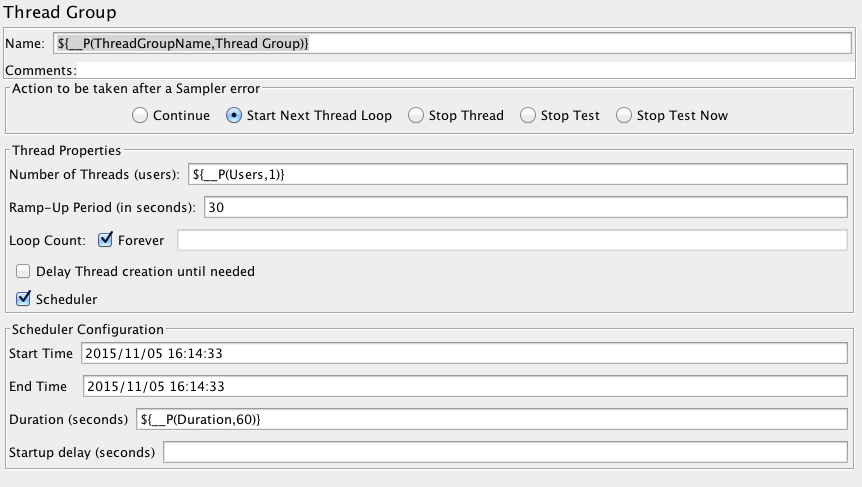

# AWS Load Test Script

A bash script that runs a jmeter test on remote servers and collates the results. 
Does not use the jmeter remote function, this improves scalability (no single controlling server).

## How it works
This tool does the following:
* takes a list of setup server ips (SERVERS)
* uploads this folder to them
* executes the server.sh script remotely which
    * installs java
    * installs jmeter
    * runs the test script (JMETER_TEST)
* downloads the result log file
* aggregates all log files
* sends the result to loadosophia.org

## To use
* Copy your jmeter test file to this folder
* Create a [loadosophia.org](https://loadosophia.org) account, get your upload token and save it to loadosophia.key
* Open loadtest.properties and update any necessary properties
* Run:

```
$ sh loadtest.sh
```

## Creating the JMeter test

To make it easy to vary test parameters, within your jmeter test Thread Group, you can set the following:

Number of Threads (users): `${__P(Users,1)}`
Duration (seconds): `${__P(Duration,60)}`

This allows you to set TEST_USERS and TEST_DURATION when running the script. These values will default to 1 and 60 
respectively.

To diferentiate between the different servers in the collated log file, name your Thred Group 
`${__P(ThreadGroupName,Thread Group)}`, this allows passing the thread group name, which the script will pass
as the server IP. 


